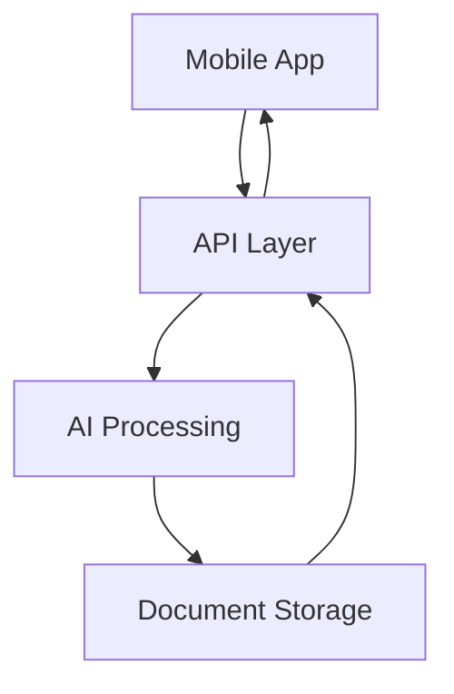

# System Architecture Overview

## High-Level Architecture

### 1. Mobile Application (MAUI)
```
CanadianVisaChatbot.Mobile/
├── ✅ Views/
│   ├── ✅ Dashboard
│   ├── ✅ DocumentManager
│   └── ✅ ApplicationProgress
├── ✅ ViewModels/
│   ├── ✅ Application Logic
│   └── ✅ State Management
└── ✅ Services/
    ├── ✅ API Integration
    └── ✅ Local Storage
```

### 2. Backend API (.NET 8)
```
CanadianVisaChatbot.Api/
├── ✅ Controllers/
│   ├── ✅ Visa Processing
│   ├── ✅ Document Management
│   └── ✅ Status Updates
├── ✅ Services/
│   ├── ✅ AI Integration
│   └── ✅ Document Processing
└── ✅ Security/
    └── ✅ Firebase Auth
```

### 3. Shared Library
```
CanadianVisaChatbot.Shared/
├── ✅ Models/
│   ├── ✅ Visa Applications
│   └── ✅ Documents
├── ✅ Services/
│   ├── ✅ DeepSeek Integration
│   └── ✅ Processing Logic
└── ✅ Utilities/
    └── ✅ Common Functions
```

## Key Components

### 1. Data Flow


### 2. Integration Points
- <span style="color:green">DeepSeek AI API</span>
- <span style="color:green">Firebase Authentication</span>
- <span style="color:green">Document Storage</span>
- External Services

### 3. Security Measures
- <span style="color:green">JWT Authentication</span>
- <span style="color:green">API Key Management</span>
- <span style="color:green">Secure Storage</span>
- <span style="color:green">Data Encryption</span>

## Technical Stack

### 1. Frontend
- .NET MAUI
- Syncfusion Controls
- Local Storage
- Firebase SDK

### 2. Backend
- ASP.NET Core
- Entity Framework
- Firebase Admin
- Azure Services

### 3. Infrastructure
- Cloud Hosting
- CDN Integration
- Load Balancing
- Monitoring Tools