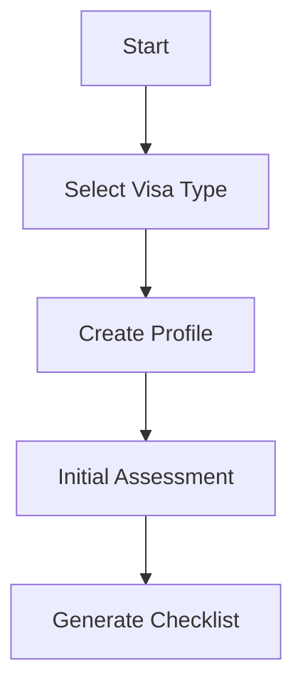
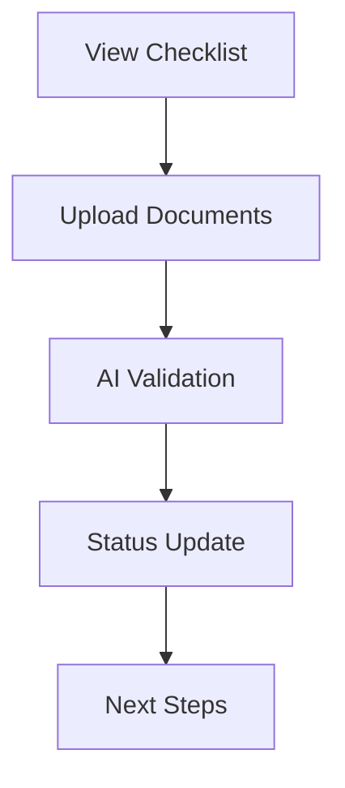
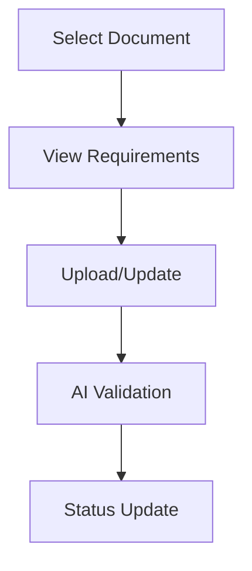
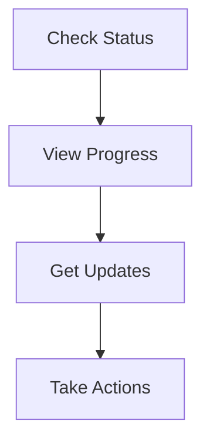

# User Flows for Visa Application Process

## Initial Application Setup

### 1. User Registration

### 2. Document Collection

## Application Processing

### 1. Document Submission
- Review Requirements
- Upload Documents
- Verify Information
- Submit for Review

### 2. Progress Tracking
- View Timeline
- Check Status
- Receive Updates
- Take Required Actions

### 3. AI Assistance
- Get Recommendations
- Review Documents
- Answer Questions
- Schedule Tasks

## Key User Interactions

### 1. Document Management

### 2. Status Monitoring

### 3. Support Features
- Chat Assistance
- Document Help
- Process Guidance
- Timeline Updates

## Error Handling

### 1. Document Issues
- Format Problems
- Missing Information
- Quality Issues
- Verification Failures

### 2. Process Errors
- Submission Failures
- Update Problems
- Sync Issues
- Connection Errors

### 3. Recovery Steps
- Error Notifications
- Correction Guidance
- Resubmission Help
- Status Recovery